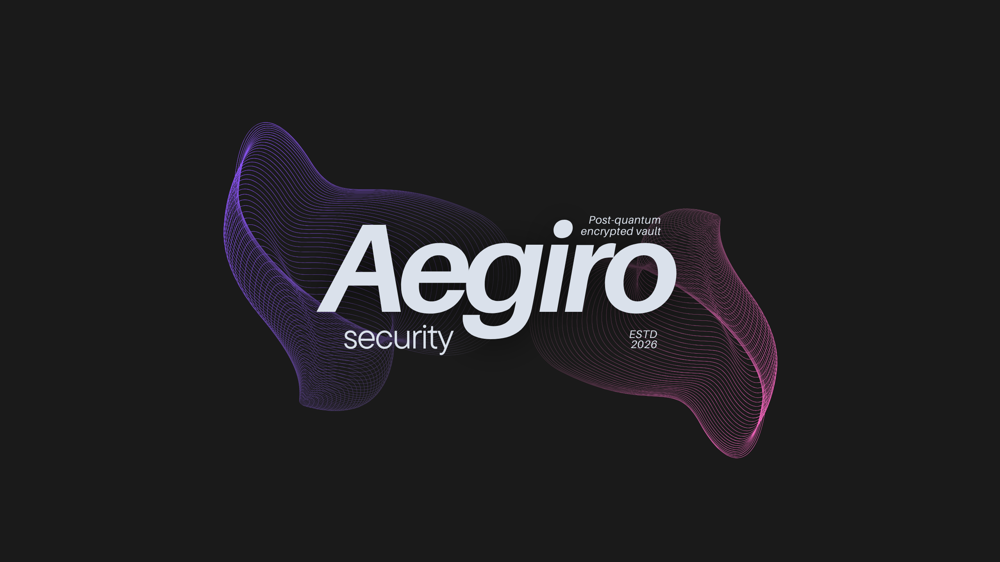

<h1 align="center">
  Aegiro
</h1>

<p align="center">
  
</p>

<p align="center">
  <strong>Local-only encrypted vault for macOS</strong><br>
  <sub>Argon2id • Chunk AEAD v1 (AES-GCM / ChaCha20-Poly1305) • Post-quantum key protection</sub>
</p>

<p align="center">
  <a href="https://github.com/Falcn8/Aegiro"></a>
  
  
  
</p>

<p align="center">
  <a href="#quick-start">Quick Start</a> •
  <a href="#protection-modes">Protection Modes</a> •
  <a href="#docs-map">Docs Map</a> •
  <a href="#build">Build</a>
</p>

---

## What Is This?

Aegiro is a local-first encrypted vault system for macOS:

- CLI + app workflows for encrypted vault operations
- AGVT v1 storage format with chunked encrypted file data
- APFS disk encryption support with recovery bundles
- Portable USB container flow for non-APFS filesystems
- Non-APFS USB file packing into `.agvt` via `usb-vault-pack`

---

## Format Status

- Active on-disk format is AGVT v1 (sequential header/wrap/index/manifest/chunk-map/chunk-area layout).
- New writes use v1 chunk key/AAD labels (`AEGIRO-FILE-KEY-V1`, `AEGIRO-CHUNK-V1`) and header `version = 1`.
- Read paths keep compatibility for existing vaults that still carry legacy v2 chunk labels.

---

## Protection Modes

| Mode | Commands | Best for | Notes |
|---|---|---|---|
| APFS volume encryption | `apfs-volume-encrypt` / `apfs-volume-decrypt` | Dedicated APFS external drives | In-place APFS encryption using `diskutil` |
| Portable encrypted container | `usb-container-create` / `usb-container-open` / `usb-container-close` | exFAT/FAT/NTFS/APFS USB drives | Encrypted APFS sparsebundle stored on host filesystem |
| Non-APFS file-level vault packing | `usb-vault-pack` | Existing non-APFS USB media | Packs user files into AGVT vault file (`data.agvt`) |

---

## Quick Start

```bash
# Build package
bash scripts/build.sh
./dist/aegiro-cli --version

# Create a vault
./dist/aegiro-cli create --vault ~/AegiroVaults/alpha.agvt --passphrase "<pass>"

# Import files
./dist/aegiro-cli import --vault ~/AegiroVaults/alpha.agvt --passphrase "<pass>" ~/Downloads/file.pdf

# Batch import in one run (faster than repeated one-file imports)
./dist/aegiro-cli import --vault ~/AegiroVaults/alpha.agvt --passphrase "<pass>" \
  ~/Downloads/file-a.pdf ~/Downloads/file-b.pdf ~/Desktop/notes.txt

# List and export
./dist/aegiro-cli list --vault ~/AegiroVaults/alpha.agvt --passphrase "<pass>"
./dist/aegiro-cli export --vault ~/AegiroVaults/alpha.agvt --passphrase "<pass>" --out ~/Recovered

# Whole-folder packing (recommended for folder/USB workflows)
./dist/aegiro-cli usb-vault-pack --source ~/MyFolder --vault ~/AegiroVaults/data.agvt --passphrase "<pass>"
```

---

## Core CLI

```text
create, import, delete, lock, unlock, list, export, preview
backup, verify, status, doctor, scan, shred
apfs-volume-encrypt, apfs-volume-decrypt
usb-container-create, usb-container-open, usb-container-close
usb-vault-pack
```

Use `./dist/aegiro-cli --help` for full options.

---

## Build

```bash
brew install liboqs argon2 openssl@3
bash scripts/build.sh
```

Outputs:

- `dist/aegiro-cli`
- `dist/aegiro-cli-macos-arm64.tar.gz`

---

## Docs Map

Jump between project markdown pages:

- [Encryption Scheme Paper (Implementation)](docs/explanations/ENCYRPTION_SCHEME_PAPER.md)
- [USB Encryption Schematics](docs/explanations/USB_ENCRYPTION_SCHEMATICS.md)
- [USB Encryption Diagrams](docs/explanations/USB_ENCRYPTION_DIAGRAMS.md)
- [Documentation Index](docs/README.md)
- [Repository Structure](docs/REPO_STRUCTURE.md)
- [App UI Design](docs/guides/UI_DESIGN.md)
- [Ownership & Usage](docs/legal/OWNERSHIP.md)
- [Agent Workflow Rules](AGENTS.md)

---

## Notes

- Default file-count limit per vault: `1,000` (`AEGIRO_MAX_FILES_PER_VAULT` to override).
- Non-APFS metadata paths are skipped in USB user-data flow.
- Prefer batched imports in one command; repeated small imports are slower because each run rewrites vault metadata/chunk map.
- Chunk encryption uses per-file derived keys and opaque chunk-map file IDs (no plaintext file paths in chunk map).
- All encryption workflows are local; no telemetry endpoints are used by default.

---

## License

This project uses a custom source-available license in [LICENSE.txt](LICENSE.txt).

- External contributions and pull requests are accepted.
- Contribution workflow and requirements are in [CONTRIBUTING.md](CONTRIBUTING.md).
- Redistribution or republication (including App Store listings and DMG/binary distribution) is not allowed.
- Full terms and ownership boundaries are defined in [LICENSE.txt](LICENSE.txt) and [docs/legal/OWNERSHIP.md](docs/legal/OWNERSHIP.md).
