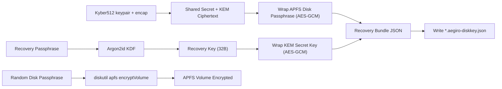
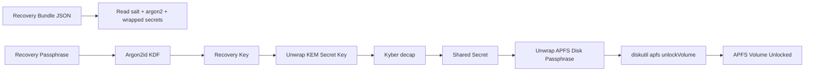
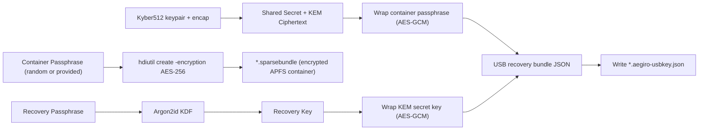
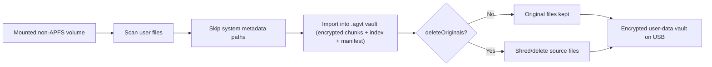

# Aegiro USB Encryption Diagrams + File Trees

This page complements `USB_ENCRYPTION_SCHEMATICS.md` with architecture diagrams
and concrete drive trees for each USB workflow.

---

## 1. USB Encryption Modes

| Mode | Command / Surface | Encrypts What | Cross-platform |
|---|---|---|---|
| APFS Volume Encryption | `apfs-volume-encrypt` / `apfs-volume-decrypt` | Entire APFS volume (FileVault/APFS) | macOS/APFS only |
| Portable Container Encryption | `usb-container-create` / `usb-container-open` / `usb-container-close` | Encrypted APFS sparsebundle file on host FS | Host FS can be exFAT/FAT/NTFS/APFS |
| Non-APFS User-Data Encryption | App UI “Encrypt USB Data” | User files packed into `.agvt` vault file | Works on non-APFS hosts (file-level) |

---

## 2. Architecture Diagrams

### 2.1 APFS Volume Encryption (`apfs-volume-encrypt`)



### 2.2 APFS Volume Unlock (`apfs-volume-decrypt`)



### 2.3 Portable Container Encryption (`usb-container-create`)



### 2.4 Non-APFS User-Data Encryption (App UI)



---

## 3. File Trees on Drive

### 3.1 APFS Volume Encryption (`apfs-volume-encrypt`)

Before:

```text
/Volumes/MyAPFSUSB/
  docs/
  photos/
  ...
```

After:

```text
/Volumes/MyAPFSUSB/                # same APFS volume, now encrypted/lockable
  docs/
  photos/
  ...

# Recovery bundle is typically stored elsewhere:
~/Backups/disk9s1.aegiro-diskkey.json
```

Notes:
- No sparsebundle is created here.
- The physical APFS volume itself is encrypted via `diskutil`.

### 3.2 Portable Container Encryption (`usb-container-create`)

Before:

```text
/Volumes/MyUSB/
  other-files/
```

After:

```text
/Volumes/MyUSB/
  aegiro-portable.sparsebundle/
    Info.plist
    token
    bands/
      0
      1
      2
      ...
  aegiro-portable.aegiro-usbkey.json
  other-files/
```

When mounted:

```text
/Volumes/AegiroUSB/
  <files inside encrypted APFS container>
```

### 3.3 Non-APFS User-Data Encryption (App UI)

Before:

```text
/Volumes/MyUSB/
  Documents/
    a.pdf
    b.jpg
  .Spotlight-V100/
  .fseventsd/
```

After (delete originals OFF):

```text
/Volumes/MyUSB/
  Documents/
    a.pdf
    b.jpg
  userdata.agvt
  .Spotlight-V100/
  .fseventsd/
```

After (delete originals ON):

```text
/Volumes/MyUSB/
  userdata.agvt
  .Spotlight-V100/
  .fseventsd/
```

---

## 4. Security + Metadata Characteristics

### APFS Volume Encryption
- Data at rest is provided by APFS/FileVault volume encryption.
- Aegiro recovery bundle protects the APFS unlock passphrase via Argon2id + Kyber + AEAD.
- Metadata visibility on host: normal mounted filesystem metadata while unlocked.

### Portable Container Encryption
- The sparsebundle content is encrypted by `hdiutil` AES-256.
- Aegiro recovery bundle protects the container passphrase.
- Host sees sparsebundle package + recovery JSON, not plaintext file tree inside container.

### User-Data `.agvt` Vault on Non-APFS
- File contents are encrypted and packed into a vault file.
- Host sees vault file size and timestamp; plaintext names are not exposed as regular files.
- Optional source deletion can reduce plaintext leftovers (best effort on SSD/APFS).

---

## 5. Operational Behavior

- `apfs-volume-encrypt`: OS-level volume operation; requires APFS and appropriate permissions.
- `usb-container-*`: container mount/unmount flow via `hdiutil`.
- App USB user-data encryption: file-level flow with optional delete originals.
- Recovery JSON files are critical; store them in a separate backup location.

---

## 6. Command Quick Reference

```bash
# APFS volume mode
./dist/aegiro-cli apfs-volume-encrypt --disk disk9s1 --passphrase "<recovery-pass>" --recovery ~/Backups/disk9s1.aegiro-diskkey.json
./dist/aegiro-cli apfs-volume-decrypt --disk disk9s1 --recovery ~/Backups/disk9s1.aegiro-diskkey.json --passphrase "<recovery-pass>"

# Portable container mode
./dist/aegiro-cli usb-container-create --image /Volumes/MyUSB/aegiro-portable.sparsebundle --size 16g --name "AegiroUSB" --passphrase "<recovery-pass>" --recovery /Volumes/MyUSB/aegiro-portable.aegiro-usbkey.json
./dist/aegiro-cli usb-container-open --image /Volumes/MyUSB/aegiro-portable.sparsebundle --recovery /Volumes/MyUSB/aegiro-portable.aegiro-usbkey.json --passphrase "<recovery-pass>"
./dist/aegiro-cli usb-container-close --target "/Volumes/AegiroUSB"
```

---

## 7. Recommended Backup Pattern

```text
Primary USB:
  /Volumes/MyUSB/aegiro-portable.sparsebundle

Separate backup location:
  ~/Backups/aegiro-portable.aegiro-usbkey.json
  ~/Backups/offline-copy/aegiro-portable.sparsebundle (optional)
```

Keep recovery JSON separate from the encrypted medium when possible.
